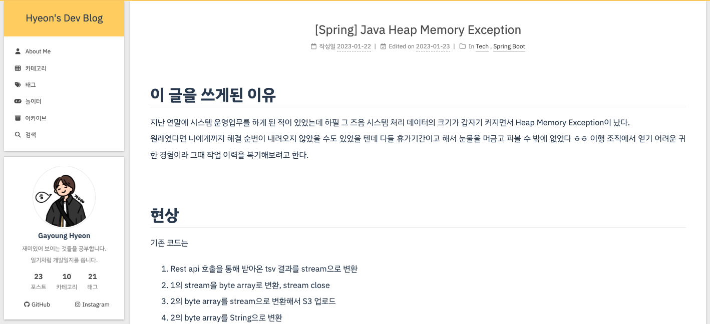
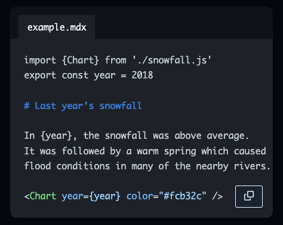

## 첫번째 이사
20년도 겨울까지 학생 때 개발 메모장 용도로 쓰던 Tistory 블로그를 그대로 잘 사용하다가 뭔가 이제 좀 개발자스러운 블로그를 갖고 싶다는 생각이 들었습니다. 웹 개발을 배운지 1년이 채 안된 때여서, (지금 생각하면 부끄럽지만) 뭐든 만들 수 있을 것 같다는 과한 자신감이 더 큰 이유였던 것 같지만 😅

Github.io에 블로그를 올리기 위해 정적 사이트 생성기 [Jekyll](https://github.com/jekyll/jekyll), [Hexo](https://github.com/hexojs/hexo), [Hugo](https://github.com/gohugoio/hugo) 를 비교해본 끝에 
- 설정이 가장 쉽고 
- 마음에 드는 테마가 있었던   

Hexo를 선택했습니다. 나름대로 명령어나 스타일도 커스터마이즈 해보고, 댓글 기능도 추가해보고 하니까 꽤 쓸만해서 잘 쓰던 중에...

*Hexo로 꾸린 (전)블로그. 귀엽죠..?*

## 두번째 이사
Github.io로 넘어오면서 제 마음대로 꾸밀 수 있는 공간을 기대했는데, 막상 Hexo에 그런 기능을 넣기에는 아래의 이유로 생각보다 불편한 점이 많았습니다. 
- 중국어로 된 레퍼런스가 많아 이해가 어려웠고
- 설정이 쉽다는 장점이 있는 대신 커스터마이징이 어려웠습니다.
- 공식 페이지에 광고가 너무 많이 붙어서 쾌적하지 않아졌다는 점도 🤫

그리하여... 첫 이사 때 정적 사이트 생성기 후보군에는 없었던 [Gatsby](https://github.com/gatsbyjs/gatsby)로 블로그를 다시 만들기로 결정했습니다. Gatsby는 React를 기반으로 만들어져 있기 때문에 제 구미에 맞는 컴포넌트를 만들어 붙일 수 있다는 엄청 큰 장점이 있었기 때문이죠.
[세팅 및 디자인이 완료되어있는 스타터 프로젝트](https://www.gatsbyjs.com/starters)의 종류도 꽤 다양해서 그 중 저는 gatsby-starter-minimal-blog 테마를 선택, 세팅했습니다.

### 이사하고 나니 의외의 좋은 점

*너무 좋지 않나요? 제가 원하던 바로 그거에요. 두근... (출처 : https://mdxjs.com/)*  
Gatsby를 세팅하면서 알게된 의외의 수확은 바로 [mdx](https://mdxjs.com/)의 존재(?)에 대해 알게 되었다는 점 입니다. Hexo로 블로그를 운영할 때 마크다운과 React를 함께 쓰고 싶다는 생각을 정말 많이 했는데요. CDN 으로 꾸역꾸역 React 컴포넌트를 붙이며 정말 이게 최선인걸까 고민도 많이 했는데. 앞으로 뭔가 만들때 여기저기 쓰기 좋은 레고블럭이 될 것 같습니다. 🤩

## 마치며
미루고 미루던 2023년도 첫 TODO를 드디어 마무리 (라고 썼지만 이제 시작이죠) 했습니다. 알찬 글 채워나가보겠습니다. 🙌